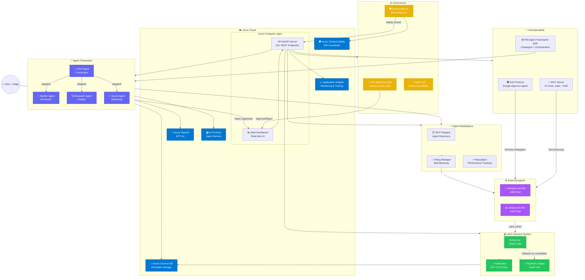
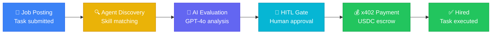
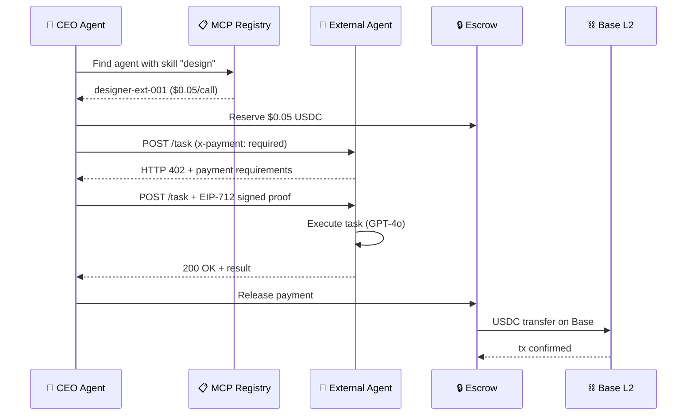

# HireWire Architecture Diagram

```mermaid
flowchart TB
    subgraph Azure["☁️ Azure Cloud"]
        subgraph ACA["Azure Container Apps"]
            direction TB
            API["🌐 FastAPI Server<br/>60+ REST Endpoints"]
            Dashboard["📊 Web Dashboard<br/>Real-time UI"]
        end

        AOI["🧠 Azure OpenAI<br/>GPT-4o"]
        Foundry["🏭 AI Foundry<br/>Agent Service"]
        Cosmos["💾 Azure Cosmos DB<br/>Persistent Storage"]
        AppInsights["📈 Application Insights<br/>Monitoring & Tracing"]
        ContentSafety["🛡️ Azure Content Safety<br/>RAI Guardrails"]
    end

    subgraph AgentFramework["🤖 Agent Framework"]
        direction TB
        CEO["👑 CEO Agent<br/>Coordinator"]
        Builder["🔨 Builder Agent<br/>Developer"]
        Research["🔍 Research Agent<br/>Analyst"]
        Social["📣 Social Agent<br/>Marketing"]

        CEO -->|"dispatch"| Builder
        CEO -->|"dispatch"| Research
        CEO -->|"dispatch"| Social
    end

    subgraph Marketplace["🏪 Agent Marketplace"]
        Registry["📋 MCP Registry<br/>Agent Discovery"]
        Hiring["🤝 Hiring Manager<br/>Skill Matching"]
        Reputation["⭐ Reputation<br/>Performance Tracking"]
    end

    subgraph Payments["💰 x402 Payment System"]
        Escrow["🔒 Escrow<br/>USDC Hold"]
        Verify["✅ Verification<br/>EIP-712 Proofs"]
        Ledger["📖 Payment Ledger<br/>Audit Trail"]
    end

    subgraph Governance["⚖️ Governance"]
        HITL["👤 HITL Approval Gate<br/>Human-in-the-Loop"]
        RAI["🛡️ Responsible AI<br/>Bias Detection"]
        Audit["📝 Audit Trail<br/>Full Accountability"]
    end

    subgraph Interop["🔗 Interoperability"]
        MCP["🔧 MCP Server<br/>10 Tools, stdio + SSE"]
        A2A["🌍 A2A Protocol<br/>Google Agent-to-Agent"]
        SDK["📦 MS Agent Framework SDK<br/>ChatAgent + Orchestration"]
    end

    subgraph External["🌐 External Agents"]
        ExtDesigner["🎨 designer-ext-001<br/>x402 Paid"]
        ExtAnalyst["📊 analyst-ext-001<br/>x402 Paid"]
    end

    User((👤 User / Judge)) -->|"Tasks, Approvals"| Dashboard
    Dashboard --> API
    API --> AgentFramework
    API --> Marketplace
    API --> Payments
    API --> Governance
    API --> Interop

    AgentFramework --> AOI
    AgentFramework --> Foundry
    AgentFramework --> Marketplace
    Marketplace --> Hiring
    Hiring --> External

    External -->|"x402 USDC"| Payments
    Payments --> Verify
    Escrow -->|"Release on completion"| Ledger

    HITL -->|"Approve/Reject"| Dashboard
    RAI -->|"Safety Scores"| API
    RAI --> ContentSafety

    AgentFramework --> Cosmos
    Payments --> Cosmos
    API --> AppInsights

    A2A -->|"Remote Delegation"| External
    MCP -->|"Tool Discovery"| External
    SDK --> AgentFramework

    classDef azure fill:#0078D4,stroke:#005a9e,color:white
    classDef agent fill:#6366f1,stroke:#4f46e5,color:white
    classDef payment fill:#22c55e,stroke:#16a34a,color:white
    classDef governance fill:#eab308,stroke:#ca8a04,color:white
    classDef external fill:#a855f7,stroke:#9333ea,color:white

    class AOI,Foundry,Cosmos,AppInsights,ContentSafety azure
    class CEO,Builder,Research,Social agent
    class Escrow,Verify,Ledger payment
    class HITL,RAI,Audit governance
    class ExtDesigner,ExtAnalyst external
```

## Hiring Pipeline Flow

```mermaid
flowchart LR
    A["📝 Job Posting<br/>Task submitted"] --> B["🔍 Agent Discovery<br/>Skill matching"]
    B --> C["🧠 AI Evaluation<br/>GPT-4o analysis"]
    C --> D["👤 HITL Gate<br/>Human approval"]
    D --> E["💰 x402 Payment<br/>USDC escrow"]
    E --> F["✅ Hired<br/>Task executed"]

    style A fill:#3b82f6,stroke:#2563eb,color:white
    style B fill:#eab308,stroke:#ca8a04,color:white
    style C fill:#6366f1,stroke:#4f46e5,color:white
    style D fill:#06b6d4,stroke:#0891b2,color:white
    style E fill:#22c55e,stroke:#16a34a,color:white
    style F fill:#22c55e,stroke:#16a34a,color:white
```

## x402 Payment Flow

```mermaid
sequenceDiagram
    participant CEO as 👑 CEO Agent
    participant Registry as 📋 MCP Registry
    participant Agent as 🎨 External Agent
    participant Escrow as 🔒 Escrow
    participant Chain as ⛓️ Base L2

    CEO->>Registry: Find agent with skill "design"
    Registry-->>CEO: designer-ext-001 ($0.05/call)
    CEO->>Escrow: Reserve $0.05 USDC
    CEO->>Agent: POST /task (x-payment: required)
    Agent-->>CEO: HTTP 402 + payment requirements
    CEO->>Agent: POST /task + EIP-712 signed proof
    Agent->>Agent: Execute task (GPT-4o)
    Agent-->>CEO: 200 OK + result
    CEO->>Escrow: Release payment
    Escrow->>Chain: USDC transfer on Base
    Chain-->>Escrow: tx confirmed
```
